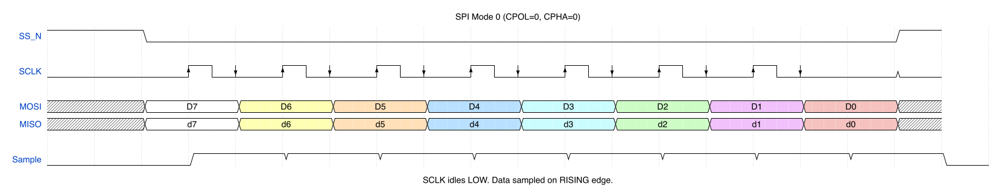
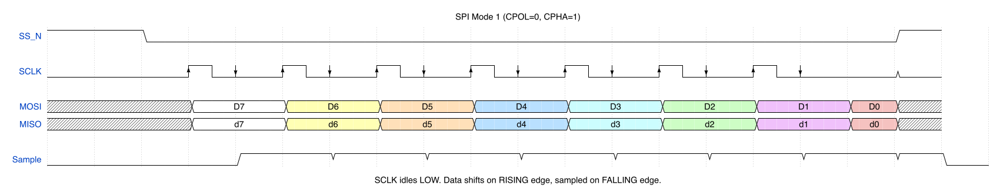
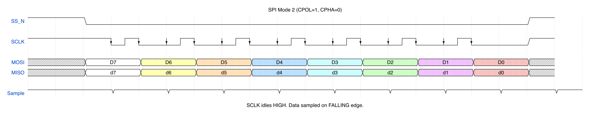
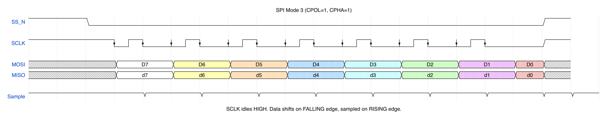

# SPI Master Controller Specification

**Document Version:** 1.0
**Date:** January 2025
**Status:** Release

---

## Table of Contents

1. [Overview](#1-overview)
2. [Features](#2-features)
3. [Block Diagram](#3-block-diagram)
4. [Signal Descriptions](#4-signal-descriptions)
5. [Register Map](#5-register-map)
6. [Functional Description](#6-functional-description)
7. [SPI Protocol](#7-spi-protocol)
8. [Timing Requirements](#8-timing-requirements)
9. [Interrupt Handling](#9-interrupt-handling)
10. [Error Conditions](#10-error-conditions)
11. [Programming Guide](#11-programming-guide)

---

## 1. Overview

The SPI Master Controller provides a serial interface for communication with SPI-compatible slave devices. It features configurable clock polarity and phase, programmable data width, and FIFO buffering for efficient data transfers.

### 1.1 Scope

This specification defines the behavior of an SPI Master controller with an APB (Advanced Peripheral Bus) slave interface for register access.

### 1.2 Definitions

| Term | Definition |
|------|------------|
| MOSI | Master Out Slave In - Data line from master to slave |
| MISO | Master In Slave Out - Data line from slave to master |
| SCLK | Serial Clock - Clock generated by master |
| SS_N | Slave Select (active low) - Selects target slave |
| CPOL | Clock Polarity - Idle state of SCLK |
| CPHA | Clock Phase - Data sampling edge |

---

## 2. Features

- APB slave interface for register access
- Support for all four SPI modes (Mode 0, 1, 2, 3)
- Configurable data width: 4, 8, 16, or 32 bits per transfer
- Programmable SCLK frequency via clock divider (2 to 256, even values)
- 8-entry TX FIFO and 8-entry RX FIFO (each entry is 32 bits)
- Support for up to 4 slave devices (directly active-low SS_N[3:0])
- Interrupt support for:
  - Transfer complete
  - TX FIFO empty
  - TX FIFO half-empty
  - RX FIFO full
  - RX FIFO half-full
  - RX FIFO overrun
- LSB-first or MSB-first data ordering
- Configurable inter-frame delay
- Loopback mode for testing

---

## 3. Block Diagram

```
                    +------------------------------------------+
                    |           SPI Master Controller          |
                    |                                          |
   APB Interface    |  +--------+    +--------+    +--------+  |    SPI Interface
                    |  |        |    |        |    |        |  |
  PCLK    -------->|  |  APB   |    | Control|    |  SPI   |  |------> SCLK
  PRESETn -------->|  | Slave  |--->| Logic  |--->| Shift  |  |------> MOSI
  PSEL    -------->|  |        |    |        |    | Reg    |  |<------ MISO
  PENABLE -------->|  +--------+    +--------+    +--------+  |------> SS_N[3:0]
  PWRITE  -------->|       |            |             |       |
  PADDR   -------->|       v            v             v       |
  PWDATA  -------->|  +--------+    +--------+    +--------+  |
  PRDATA  <--------|  |  Reg   |    | TX     |    | RX     |  |
  PREADY  <--------|  | File   |    | FIFO   |    | FIFO   |  |
                    |  +--------+    +--------+    +--------+  |
                    |                                          |
  IRQ     <--------|                                          |
                    +------------------------------------------+
```

---

## 4. Signal Descriptions

### 4.1 APB Interface Signals

| Signal | Direction | Width | Description |
|--------|-----------|-------|-------------|
| PCLK | Input | 1 | APB clock |
| PRESETn | Input | 1 | Active-low reset |
| PSEL | Input | 1 | Peripheral select |
| PENABLE | Input | 1 | Enable phase indicator |
| PWRITE | Input | 1 | Write/Read indicator (1=Write) |
| PADDR | Input | 8 | Byte address |
| PWDATA | Input | 32 | Write data |
| PRDATA | Output | 32 | Read data |
| PREADY | Output | 1 | Transfer ready (always 1, no wait states) |

### 4.2 SPI Interface Signals

| Signal | Direction | Width | Description |
|--------|-----------|-------|-------------|
| SCLK | Output | 1 | Serial clock |
| MOSI | Output | 1 | Master Out Slave In data |
| MISO | Input | 1 | Master In Slave Out data |
| SS_N | Output | 4 | Active-low slave selects |

### 4.3 Interrupt Signal

| Signal | Direction | Width | Description |
|--------|-----------|-------|-------------|
| IRQ | Output | 1 | Interrupt request (active high) |

---

## 5. Register Map

Base Address: 0x00

| Offset | Name | Access | Reset Value | Description |
|--------|------|--------|-------------|-------------|
| 0x00 | CTRL | R/W | 0x0000_0000 | Control Register |
| 0x04 | STATUS | R/W1C | 0x0000_0002 | Status Register |
| 0x08 | CLKDIV | R/W | 0x0000_0002 | Clock Divider Register |
| 0x0C | SSCTL | R/W | 0x0000_000F | Slave Select Control |
| 0x10 | TXDATA | W | - | Transmit Data Register |
| 0x14 | RXDATA | R | 0x0000_0000 | Receive Data Register |
| 0x18 | INTEN | R/W | 0x0000_0000 | Interrupt Enable Register |
| 0x1C | INTSTAT | R/W1C | 0x0000_0000 | Interrupt Status Register |
| 0x20 | FIFOST | R | 0x0000_0800 | FIFO Status Register |

### 5.1 Control Register (CTRL) - Offset 0x00

| Bits | Name | Access | Reset | Description |
|------|------|--------|-------|-------------|
| 0 | EN | R/W | 0 | SPI Enable (1=enabled) |
| 1 | CPOL | R/W | 0 | Clock Polarity (0=idle low, 1=idle high) |
| 2 | CPHA | R/W | 0 | Clock Phase (0=sample first edge, 1=sample second edge) |
| 3 | LSBF | R/W | 0 | LSB First (0=MSB first, 1=LSB first) |
| 4 | LOOP | R/W | 0 | Loopback Mode (1=MOSI connected to MISO internally) |
| 6:5 | DSIZE | R/W | 0 | Data Size: 00=8bit, 01=16bit, 10=32bit, 11=4bit |
| 7 | MANUAL_SS | R/W | 0 | Manual SS Control (1=SS controlled by SSCTL.SS_LEVEL) |
| 15:8 | IFD | R/W | 0 | Inter-Frame Delay (SCLK cycles between transfers) |
| 31:16 | Reserved | R | 0 | Reserved, read as zero |

### 5.2 Status Register (STATUS) - Offset 0x04

| Bits | Name | Access | Reset | Description |
|------|------|--------|-------|-------------|
| 0 | BUSY | R | 0 | SPI busy (transfer in progress) |
| 1 | TXE | R | 1 | TX FIFO empty |
| 2 | TXNF | R | 1 | TX FIFO not full |
| 3 | RXNE | R | 0 | RX FIFO not empty |
| 4 | RXF | R | 0 | RX FIFO full |
| 5 | RXOVR | R/W1C | 0 | RX FIFO overrun (write 1 to clear) |
| 31:6 | Reserved | R | 0 | Reserved |

### 5.3 Clock Divider Register (CLKDIV) - Offset 0x08

| Bits | Name | Access | Reset | Description |
|------|------|--------|-------|-------------|
| 7:0 | DIV | R/W | 2 | Clock divider value (SCLK = PCLK / DIV) |
| 31:8 | Reserved | R | 0 | Reserved |

**Note:** DIV must be an even value >= 2. Odd values are rounded down. DIV=0 is treated as DIV=2.

### 5.4 Slave Select Control (SSCTL) - Offset 0x0C

| Bits | Name | Access | Reset | Description |
|------|------|--------|-------|-------------|
| 3:0 | SS_SEL | R/W | 0xF | Slave select mask (bit N: 0=select slave N, 1=deselect) |
| 4 | SS_LEVEL | R/W | 1 | Manual SS level when MANUAL_SS=1 |
| 31:5 | Reserved | R | 0 | Reserved |

**Note:** In automatic mode (MANUAL_SS=0), SS_SEL is applied during transfers. In manual mode (MANUAL_SS=1), SS_N outputs directly reflect {3{SS_LEVEL}, SS_SEL[0] | SS_LEVEL}.

### 5.5 Transmit Data Register (TXDATA) - Offset 0x10

| Bits | Name | Access | Reset | Description |
|------|------|--------|-------|-------------|
| 31:0 | DATA | W | - | Transmit data (writes push to TX FIFO) |

**Note:** Only bits relevant to DSIZE are transmitted. Writing when TX FIFO is full has no effect.

### 5.6 Receive Data Register (RXDATA) - Offset 0x14

| Bits | Name | Access | Reset | Description |
|------|------|--------|-------|-------------|
| 31:0 | DATA | R | 0 | Receive data (reads pop from RX FIFO) |

**Note:** Only bits relevant to DSIZE are valid. Reading when RX FIFO is empty returns last valid data.

### 5.7 Interrupt Enable Register (INTEN) - Offset 0x18

| Bits | Name | Access | Reset | Description |
|------|------|--------|-------|-------------|
| 0 | TC_IE | R/W | 0 | Transfer Complete interrupt enable |
| 1 | TXE_IE | R/W | 0 | TX FIFO Empty interrupt enable |
| 2 | TXHE_IE | R/W | 0 | TX FIFO Half-Empty interrupt enable |
| 3 | RXF_IE | R/W | 0 | RX FIFO Full interrupt enable |
| 4 | RXHF_IE | R/W | 0 | RX FIFO Half-Full interrupt enable |
| 5 | RXOVR_IE | R/W | 0 | RX FIFO Overrun interrupt enable |
| 31:6 | Reserved | R | 0 | Reserved |

### 5.8 Interrupt Status Register (INTSTAT) - Offset 0x1C

| Bits | Name | Access | Reset | Description |
|------|------|--------|-------|-------------|
| 0 | TC | R/W1C | 0 | Transfer Complete (write 1 to clear) |
| 1 | TXE | R | 0 | TX FIFO Empty |
| 2 | TXHE | R | 0 | TX FIFO Half-Empty (<=4 entries) |
| 3 | RXF | R | 0 | RX FIFO Full |
| 4 | RXHF | R | 0 | RX FIFO Half-Full (>=4 entries) |
| 5 | RXOVR | R/W1C | 0 | RX FIFO Overrun (write 1 to clear) |
| 31:6 | Reserved | R | 0 | Reserved |

### 5.9 FIFO Status Register (FIFOST) - Offset 0x20

| Bits | Name | Access | Reset | Description |
|------|------|--------|-------|-------------|
| 3:0 | TX_LEVEL | R | 0 | Number of entries in TX FIFO (0-8) |
| 7:4 | Reserved | R | 0 | Reserved |
| 11:8 | RX_LEVEL | R | 0 | Number of entries in RX FIFO (0-8) |
| 31:12 | Reserved | R | 0 | Reserved |

---

## 6. Functional Description

### 6.1 Basic Operation

1. Configure the SPI mode (CPOL, CPHA) and data size in CTRL register
2. Set the clock divider in CLKDIV register
3. Select target slave(s) via SSCTL register
4. Enable the SPI master by setting CTRL.EN = 1
5. Write data to TXDATA register to initiate transfers
6. Read received data from RXDATA register

### 6.2 Transfer Sequence (Automatic SS Mode)

When CTRL.MANUAL_SS = 0:

1. Software writes data to TXDATA
2. If SPI is idle (not BUSY), transfer begins immediately
3. SS_N is asserted (driven low) based on SS_SEL
4. After inter-frame delay (IFD), SCLK begins toggling
5. Data is shifted out on MOSI, shifted in from MISO
6. After all bits transferred, SCLK stops
7. If more data in TX FIFO, next transfer begins after IFD delay
8. If TX FIFO empty, SS_N is deasserted after IFD delay
9. STATUS.BUSY clears when SS_N deasserts

### 6.3 Transfer Sequence (Manual SS Mode)

When CTRL.MANUAL_SS = 1:

1. Software controls SS_N directly via SSCTL.SS_LEVEL
2. Software asserts SS by writing SS_LEVEL = 0
3. Software writes data to TXDATA to initiate transfers
4. Transfers proceed without automatic SS deassertion
5. Software deasserts SS by writing SS_LEVEL = 1

### 6.4 FIFO Behavior

**TX FIFO:**
- 8 entries deep, 32 bits wide
- Write to TXDATA pushes data (if not full)
- Data automatically popped when shift register needs it
- Empty flag set when FIFO has 0 entries
- Half-empty when FIFO has 4 or fewer entries

**RX FIFO:**
- 8 entries deep, 32 bits wide
- Data pushed automatically when shift register fills
- Read from RXDATA pops data (if not empty)
- Full flag set when FIFO has 8 entries
- Half-full when FIFO has 4 or more entries
- Overrun occurs if data arrives when full (data lost)

### 6.5 Loopback Mode

When CTRL.LOOP = 1:
- MOSI is internally connected to MISO
- External MISO input is ignored
- Useful for self-test without external slave

---

## 7. SPI Protocol

### 7.1 SPI Modes

The SPI master supports all four standard SPI modes:

| Mode | CPOL | CPHA | Idle State | Sample Edge | Shift Edge |
|------|------|------|------------|-------------|------------|
| 0 | 0 | 0 | Low | Rising | Falling |
| 1 | 0 | 1 | Low | Falling | Rising |
| 2 | 1 | 0 | High | Falling | Rising |
| 3 | 1 | 1 | High | Rising | Falling |

### 7.2 Mode 0 Timing (CPOL=0, CPHA=0)



- SCLK idles low (CPOL=0)
- Data is valid before the first clock edge
- Data is sampled on the rising edge of SCLK (CPHA=0)
- Data changes on the falling edge of SCLK

### 7.3 Mode 1 Timing (CPOL=0, CPHA=1)



- SCLK idles low (CPOL=0)
- Data changes on the rising edge of SCLK
- Data is sampled on the falling edge of SCLK (CPHA=1)

### 7.4 Mode 2 Timing (CPOL=1, CPHA=0)



- SCLK idles high (CPOL=1)
- Data is valid before the first clock edge
- Data is sampled on the falling edge of SCLK (CPHA=0)
- Data changes on the rising edge of SCLK

### 7.5 Mode 3 Timing (CPOL=1, CPHA=1)



- SCLK idles high (CPOL=1)
- Data changes on the falling edge of SCLK
- Data is sampled on the rising edge of SCLK (CPHA=1)

### 7.6 Data Ordering

**MSB First (LSBF=0):** Bit 7 (or 15/31/3 depending on DSIZE) transmitted first
**LSB First (LSBF=1):** Bit 0 transmitted first

---

## 8. Timing Requirements

### 8.1 Clock Relationships

- SCLK frequency = PCLK / CLKDIV.DIV
- Minimum CLKDIV.DIV = 2 (SCLK = PCLK/2)
- Maximum CLKDIV.DIV = 256 (SCLK = PCLK/256)

### 8.2 Setup and Hold Times

All timing is synchronous to PCLK:

| Parameter | Min | Max | Unit | Description |
|-----------|-----|-----|------|-------------|
| tSS_SETUP | 1 | - | SCLK | SS_N assertion to first SCLK edge |
| tSS_HOLD | 1 | - | SCLK | Last SCLK edge to SS_N deassertion |
| tIFD | 0 | 255 | SCLK | Inter-frame delay (programmable) |
| tMISO_SETUP | 0.25 | - | SCLK | MISO setup time before sampling edge |
| tMISO_HOLD | 0.25 | - | SCLK | MISO hold time after sampling edge |
| tMOSI_VALID | - | 0.5 | SCLK | MOSI valid after shift edge |

### 8.3 Reset Timing

- All registers reset to default values on PRESETn assertion
- Ongoing transfers are aborted on reset
- FIFOs are cleared on reset

---

## 9. Interrupt Handling

### 9.1 Interrupt Generation

IRQ = (INTSTAT.TC & INTEN.TC_IE) |
      (INTSTAT.TXE & INTEN.TXE_IE) |
      (INTSTAT.TXHE & INTEN.TXHE_IE) |
      (INTSTAT.RXF & INTEN.RXF_IE) |
      (INTSTAT.RXHF & INTEN.RXHF_IE) |
      (INTSTAT.RXOVR & INTEN.RXOVR_IE)

### 9.2 Interrupt Clearing

- TC: Write 1 to INTSTAT.TC
- TXE: Automatically clears when TX FIFO becomes non-empty
- TXHE: Automatically clears when TX FIFO has more than 4 entries
- RXF: Automatically clears when RX FIFO becomes not full
- RXHF: Automatically clears when RX FIFO has fewer than 4 entries
- RXOVR: Write 1 to INTSTAT.RXOVR (or STATUS.RXOVR)

### 9.3 Transfer Complete (TC)

TC is set when:
- In automatic SS mode: SS_N deasserts after transfers complete
- In manual SS mode: Last bit of last FIFO entry is shifted

---

## 10. Error Conditions

### 10.1 RX FIFO Overrun

- Occurs when received data arrives while RX FIFO is full
- The new data is lost
- STATUS.RXOVR and INTSTAT.RXOVR are set
- Cleared by writing 1 to either register

### 10.2 TX FIFO Write When Full

- Write to TXDATA when TX FIFO is full
- The write is ignored (no error flag)
- Software should check STATUS.TXNF before writing

### 10.3 RX FIFO Read When Empty

- Read from RXDATA when RX FIFO is empty
- Returns the last valid data read
- Software should check STATUS.RXNE before reading

---

## 11. Programming Guide

### 11.1 Initialization Sequence

```
1. Assert reset (PRESETn = 0), then deassert
2. Configure CLKDIV for desired SCLK frequency
3. Configure CTRL (mode, data size, options) - keep EN=0
4. Configure INTEN if using interrupts
5. Set SSCTL for target slave
6. Set CTRL.EN = 1 to enable
```

### 11.2 Polled Transmit

```
1. Check STATUS.TXNF = 1 (TX FIFO not full)
2. Write data to TXDATA
3. Repeat for all data
4. Wait for STATUS.BUSY = 0 (transfers complete)
5. Read RXDATA for received data
```

### 11.3 Polled Receive

```
1. Write dummy data to TXDATA to generate clocks
2. Wait for STATUS.RXNE = 1 (data available)
3. Read RXDATA
4. Repeat as needed
```

### 11.4 Interrupt-Driven Operation

```
1. Enable desired interrupts in INTEN
2. Write initial data to TXDATA
3. In ISR:
   - If TXHE: Refill TX FIFO
   - If RXHF: Read RX FIFO
   - If TC: Transfer complete, process results
   - If RXOVR: Handle error
4. Clear interrupt flags as appropriate
```

### 11.5 Continuous Transfer (Streaming)

For continuous transfers without SS_N toggling:
```
1. Set CTRL.MANUAL_SS = 1
2. Write SSCTL.SS_LEVEL = 0 (assert SS)
3. Write data to TXDATA continuously
4. Keep TX FIFO fed to prevent SS deassertion
5. Write SSCTL.SS_LEVEL = 1 when done (deassert SS)
```

---

## Revision History

| Version | Date | Description |
|---------|------|-------------|
| 1.0 | Jan 2025 | Initial release |

---

*End of Specification*
