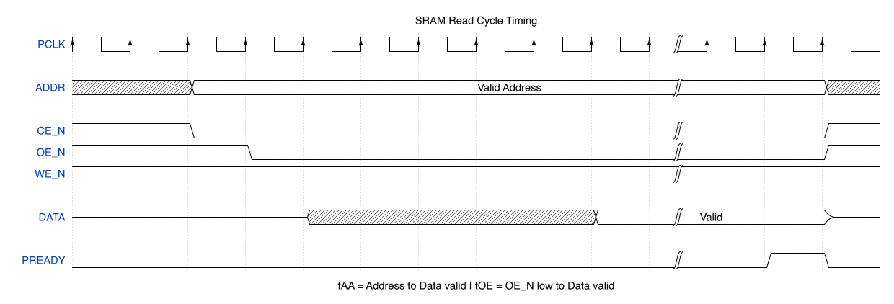
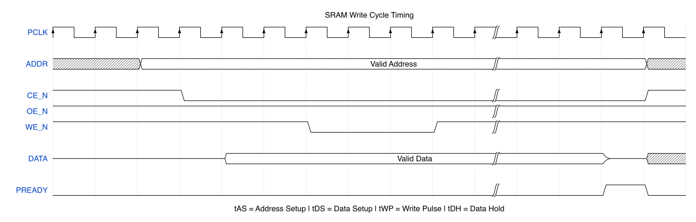

# SRAM Controller Specification

**Document Version:** 1.0
**Date:** January 2025
**Status:** Release

---

## Table of Contents

1. [Overview](#1-overview)
2. [Features](#2-features)
3. [Block Diagram](#3-block-diagram)
4. [Signal Descriptions](#4-signal-descriptions)
5. [Register Map](#5-register-map)
6. [Functional Description](#6-functional-description)
7. [Timing Requirements](#7-timing-requirements)
8. [Error Handling](#8-error-handling)
9. [Programming Guide](#9-programming-guide)

---

## 1. Overview

The SRAM Controller provides an interface between an APB bus master and an external asynchronous SRAM device. It handles address/data multiplexing, timing generation, and protocol conversion.

### 1.1 Scope

This specification defines an SRAM controller with:
- APB slave interface for CPU access
- External SRAM interface with configurable timing
- Support for byte, half-word, and word accesses

### 1.2 Definitions

| Term | Definition |
|------|------------|
| SRAM | Static Random Access Memory |
| APB | Advanced Peripheral Bus |
| tAA | Address Access Time - time from address valid to data valid |
| tOE | Output Enable Access Time - time from OE_N low to data valid |
| tWC | Write Cycle Time - minimum time for a complete write |
| tAS | Address Setup Time - address valid before WE_N falls |
| tAH | Address Hold Time - address valid after WE_N rises |
| tDS | Data Setup Time - data valid before WE_N rises |
| tDH | Data Hold Time - data valid after WE_N rises |

---

## 2. Features

- APB slave interface for register and memory access
- Support for 64KB external SRAM (16-bit address, 8-bit data)
- Configurable timing parameters via registers
- Byte, half-word (16-bit), and word (32-bit) access support
- Read and write operations with proper timing generation
- Busy status indication
- Optional wait state insertion
- Error detection for timing violations (simulation only)

---

## 3. Block Diagram

```
                    +------------------------------------------+
                    |           SRAM Controller                |
                    |                                          |
   APB Interface    |  +--------+    +--------+    +--------+  |   SRAM Interface
                    |  |        |    |        |    |        |  |
  PCLK    -------->|  |  APB   |    | Timing |    |  SRAM  |  |-----> ADDR[15:0]
  PRESETn -------->|  | Slave  |--->| Control|--->|  I/O   |  |<----> DATA[7:0]
  PSEL    -------->|  |        |    |        |    |        |  |-----> CE_N
  PENABLE -------->|  +--------+    +--------+    +--------+  |-----> OE_N
  PWRITE  -------->|       |            |                     |-----> WE_N
  PADDR   -------->|       v            v                     |
  PWDATA  -------->|  +--------+    +--------+               |
  PRDATA  <--------|  |  Reg   |    | Status |               |
  PREADY  <--------|  | File   |    |        |               |
                    |  +--------+    +--------+               |
                    |                                          |
                    +------------------------------------------+
```

---

## 4. Signal Descriptions

### 4.1 APB Interface Signals

| Signal | Direction | Width | Description |
|--------|-----------|-------|-------------|
| PCLK | Input | 1 | APB clock |
| PRESETn | Input | 1 | Active-low reset |
| PSEL | Input | 1 | Peripheral select |
| PENABLE | Input | 1 | Enable phase indicator |
| PWRITE | Input | 1 | Write/Read indicator (1=Write) |
| PADDR | Input | 32 | Byte address |
| PWDATA | Input | 32 | Write data |
| PRDATA | Output | 32 | Read data |
| PREADY | Output | 1 | Transfer ready (may insert wait states) |
| PSLVERR | Output | 1 | Transfer error |

### 4.2 SRAM Interface Signals

| Signal | Direction | Width | Description |
|--------|-----------|-------|-------------|
| SRAM_ADDR | Output | 16 | SRAM address bus |
| SRAM_DATA | Inout | 8 | SRAM bidirectional data bus |
| SRAM_CE_N | Output | 1 | Chip Enable (active low) |
| SRAM_OE_N | Output | 1 | Output Enable (active low) |
| SRAM_WE_N | Output | 1 | Write Enable (active low) |

---

## 5. Register Map

The controller has two address regions:
- **0x0000_0000 - 0x0000_00FF**: Control/Status registers
- **0x0001_0000 - 0x0001_FFFF**: SRAM memory window (directly mapped)

### 5.1 Control Register Map

| Offset | Name | Access | Reset Value | Description |
|--------|------|--------|-------------|-------------|
| 0x00 | CTRL | R/W | 0x0000_0001 | Control Register |
| 0x04 | STATUS | R | 0x0000_0000 | Status Register |
| 0x08 | TIMING0 | R/W | 0x0000_0505 | Timing Register 0 |
| 0x0C | TIMING1 | R/W | 0x0000_0303 | Timing Register 1 |

### 5.2 Control Register (CTRL) - Offset 0x00

| Bits | Name | Access | Reset | Description |
|------|------|--------|-------|-------------|
| 0 | EN | R/W | 1 | Controller Enable (1=enabled) |
| 1 | WIDTH | R/W | 0 | Data width: 0=8-bit SRAM, 1=16-bit SRAM |
| 7:2 | Reserved | R | 0 | Reserved |
| 15:8 | WAIT | R/W | 0 | Additional wait states (0-255) |
| 31:16 | Reserved | R | 0 | Reserved |

### 5.3 Status Register (STATUS) - Offset 0x04

| Bits | Name | Access | Reset | Description |
|------|------|--------|-------|-------------|
| 0 | BUSY | R | 0 | Controller busy with SRAM access |
| 1 | ERROR | R | 0 | Access error (cleared on read) |
| 31:2 | Reserved | R | 0 | Reserved |

### 5.4 Timing Register 0 (TIMING0) - Offset 0x08

| Bits | Name | Access | Reset | Description |
|------|------|--------|-------|-------------|
| 7:0 | tAA | R/W | 5 | Address Access Time (PCLK cycles) |
| 15:8 | tOE | R/W | 5 | Output Enable Access Time (PCLK cycles) |
| 31:16 | Reserved | R | 0 | Reserved |

### 5.5 Timing Register 1 (TIMING1) - Offset 0x0C

| Bits | Name | Access | Reset | Description |
|------|------|--------|-------|-------------|
| 7:0 | tWC | R/W | 3 | Write Cycle Time (PCLK cycles) |
| 15:8 | tAS | R/W | 3 | Address Setup Time (PCLK cycles) |
| 23:16 | tDS | R/W | 2 | Data Setup Time (PCLK cycles) |
| 31:24 | Reserved | R | 0 | Reserved |

---

## 6. Functional Description

### 6.1 Memory Mapping

The SRAM is accessed through a memory window at base address 0x0001_0000:
- APB Address 0x0001_0000 → SRAM Address 0x0000
- APB Address 0x0001_FFFF → SRAM Address 0xFFFF

### 6.2 Read Operation

1. APB master initiates read to memory window
2. Controller drives SRAM_ADDR with target address
3. Controller asserts CE_N (low)
4. Controller asserts OE_N (low)
5. Controller waits for tAA/tOE cycles
6. Controller samples SRAM_DATA
7. Controller deasserts CE_N and OE_N
8. Controller returns data on PRDATA, asserts PREADY



### 6.3 Write Operation

1. APB master initiates write to memory window
2. Controller drives SRAM_ADDR with target address
3. Controller waits tAS cycles (address setup)
4. Controller asserts CE_N (low)
5. Controller drives SRAM_DATA with write data
6. Controller waits tDS cycles (data setup)
7. Controller asserts WE_N (low)
8. Controller waits for write pulse width
9. Controller deasserts WE_N (high)
10. Controller holds data for tDH cycles
11. Controller deasserts CE_N, releases SRAM_DATA
12. Controller asserts PREADY



### 6.4 Multi-Byte Access

For word (32-bit) access to 8-bit SRAM:
- Controller performs 4 sequential byte accesses
- Address increments automatically
- Data assembled/disassembled by controller
- PREADY held low until all bytes complete

### 6.5 Wait States

The WAIT field in CTRL adds additional clock cycles to each access:
- Total read time = tAA + WAIT cycles
- Total write time = tWC + WAIT cycles

---

## 7. Timing Requirements

### 7.1 Read Cycle Timing

```
         ___________                              ___________
CE_N               |____________________________|

         _______________                      _______________
OE_N                   |______________________|

                       |<-------- tOE ------->|
ADDR    ---------------<  Valid Address       >---------------
         |<-------------- tAA --------------->|

DATA    ---------------XXXXXXXX<  Valid Data  >---------------
```

### 7.2 Write Cycle Timing

```
                |<-tAS->|                     |
ADDR    --------<       Valid Address         >---------------

                        ___________________
CE_N    _______________|                   |__________________

                              _________
WE_N    _____________________|         |______________________
                             |<-tWP-->|
                       |<-tDS->|     |<-tDH->|
DATA    ---------------<    Valid Data       >----------------

         |<---------------- tWC ---------------->|
```

### 7.3 Timing Parameter Ranges

| Parameter | Min | Default | Max | Unit | Description |
|-----------|-----|---------|-----|------|-------------|
| tAA | 1 | 5 | 255 | PCLK | Address access time |
| tOE | 1 | 5 | 255 | PCLK | Output enable access time |
| tWC | 1 | 3 | 255 | PCLK | Write cycle time |
| tAS | 0 | 3 | 255 | PCLK | Address setup time |
| tDS | 0 | 2 | 255 | PCLK | Data setup time |
| tDH | 1 | 1 | - | PCLK | Data hold time (fixed) |
| tWP | 1 | 1 | - | PCLK | Write pulse width (fixed) |

---

## 8. Error Handling

### 8.1 Access When Disabled

If EN=0 and an access to the memory window is attempted:
- PSLVERR is asserted
- STATUS.ERROR is set
- No SRAM access occurs

### 8.2 Invalid Address

Access to undefined register addresses (0x10-0xFF) returns 0 on read, ignored on write.

---

## 9. Programming Guide

### 9.1 Initialization Sequence

```
1. Ensure PRESETn is asserted then deasserted
2. Configure timing parameters in TIMING0 and TIMING1
   - Set tAA and tOE based on SRAM datasheet
   - Set tWC, tAS, tDS based on SRAM datasheet
3. Configure CTRL register
   - Set WIDTH based on SRAM data width
   - Set WAIT if additional margin needed
   - Set EN=1 to enable controller
```

### 9.2 Read Example

```
1. Verify STATUS.BUSY = 0
2. Read from address 0x0001_0000 + offset
3. Wait for PREADY
4. Data available on PRDATA
```

### 9.3 Write Example

```
1. Verify STATUS.BUSY = 0
2. Write data to address 0x0001_0000 + offset
3. Wait for PREADY
4. Verify STATUS.ERROR = 0
```

### 9.4 Timing Configuration Example

For a 55ns SRAM with 100MHz PCLK (10ns period):
- tAA = 55ns / 10ns = 6 cycles (round up)
- tOE = 25ns / 10ns = 3 cycles
- tWC = 55ns / 10ns = 6 cycles
- tAS = 0ns / 10ns = 0 cycles (but use 1 for margin)
- tDS = 25ns / 10ns = 3 cycles

```
Write TIMING0 = 0x0000_0306  // tOE=3, tAA=6
Write TIMING1 = 0x0003_0106  // tDS=3, tAS=1, tWC=6
Write CTRL = 0x0000_0001     // EN=1, WIDTH=0 (8-bit)
```

---

## Revision History

| Version | Date | Description |
|---------|------|-------------|
| 1.0 | Jan 2025 | Initial release |

---

*End of Specification*
